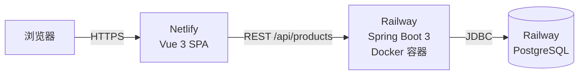

# Campus Trade — 校园二手交易平台

> 求职作品集项目 · 前后端分离 · 全栈云端部署

## 在线演示

| 端点 | 地址 |
|---|---|
| 前端站点 | https://campus-trade-app.netlify.app |
| REST API | https://campus-trade-production-a0ef.up.railway.app/api/products |
| 健康检查 | https://campus-trade-production-a0ef.up.railway.app/actuator/health |

## 功能特性

- 商品列表：按分类浏览（教材书籍 / 数码电子 / 生活用品 / 运动户外），分类筛选即点即切
- 发布商品：表单校验（必填/数值/长度）→ `POST /api/products` → 创建成功跳转详情页
- 商品详情：现价、原价对比、卖家认证信息
- 种子数据：数据库表为空时自动写入 6 条示例商品（`DataInitializer`）

## 技术栈

| 层 | 技术 |
|---|---|
| 前端 | Vue 3 + TypeScript + Vite + Vue Router |
| 后端 | Spring Boot 3.2 (Java 17)、Spring Data JPA、Validation、Actuator |
| 数据库 | PostgreSQL |
| 部署 | Docker 多阶段构建 · Railway（后端 + 数据库）· Netlify（前端，CI/CD 随 push 自动构建） |

## 架构



## 目录结构

```
├── backend/                # Spring Boot 后端（Railway 部署根目录）
│   ├── Dockerfile          # maven 构建 → JRE 17 运行 多阶段镜像
│   ├── pom.xml
│   └── src/main/java/com/campus/trade/
│       ├── controller/     # ProductController（REST 接口）
│       ├── entity/         # Product 实体
│       ├── repository/     # Spring Data JPA
│       ├── config/         # CORS 配置、种子数据初始化
│       └── CampusTradeApplication.java
└── frontend/               # Vue 3 前端（Netlify 部署根目录）
    ├── netlify.toml        # 构建命令 + SPA 路由回退
    └── src/                # Home / ProductDetail 页面
```

## API 一览

| 方法 | 路径 | 说明 |
|---|---|---|
| GET | `/api/products` | 商品列表 |
| GET | `/api/products/{id}` | 商品详情 |
| POST | `/api/products` | 发布商品（Bean Validation 校验请求体） |
| GET | `/actuator/health` | 健康检查（Railway 部署探针） |

## 本地运行

后端（需本地 PostgreSQL 或使用环境变量指向远程库）：

```bash
cd backend
DATABASE_URL=jdbc:postgresql://localhost:5432/campus \
DATABASE_USER=postgres DATABASE_PASSWORD=postgres \
mvn spring-boot:run
```

前端：

```bash
cd frontend
npm install
npm run dev      # http://localhost:5173
```

## 关键配置说明

| 变量 | 作用 | 备注 |
|---|---|---|
| `DATABASE_URL` / `DATABASE_USER` / `DATABASE_PASSWORD` | 后端数据源 | Railway 中引用 Postgres 服务变量 |
| `PGHOST` / `PGPORT` / `PGDATABASE` / `PGUSER` / `PGPASSWORD` | Railway Postgres 注入 | 通过 `${{Postgres.*}}` 引用 |
| `VITE_API_BASE_URL` | 前端构建期注入的 API 地址 | Netlify 环境变量 |
| `FRONTEND_URL` | 后端 CORS 允许来源 | 与前端域名保持一致 |
| `PORT` | 容器监听端口 | Railway 自动注入，Spring 读取 `${PORT:8080}` |

## 部署要点

- **后端（Railway）**：Root Directory 设为 `backend`，Railpack 自动检测 Dockerfile 多阶段构建；服务变量通过 `${{Postgres.PGHOST}}` 等引用数据库实例，实现同项目内网互通。
- **前端（Netlify）**：Root Directory 设为 `frontend`，构建命令 `npm run build`，发布目录 `dist`；`netlify.toml` 配置 SPA 回退，保证 `/product/:id` 直链可访问。
- **CORS**：后端从 `FRONTEND_URL` 读取允许的来源，部署前端后回填即可完成双向打通。
